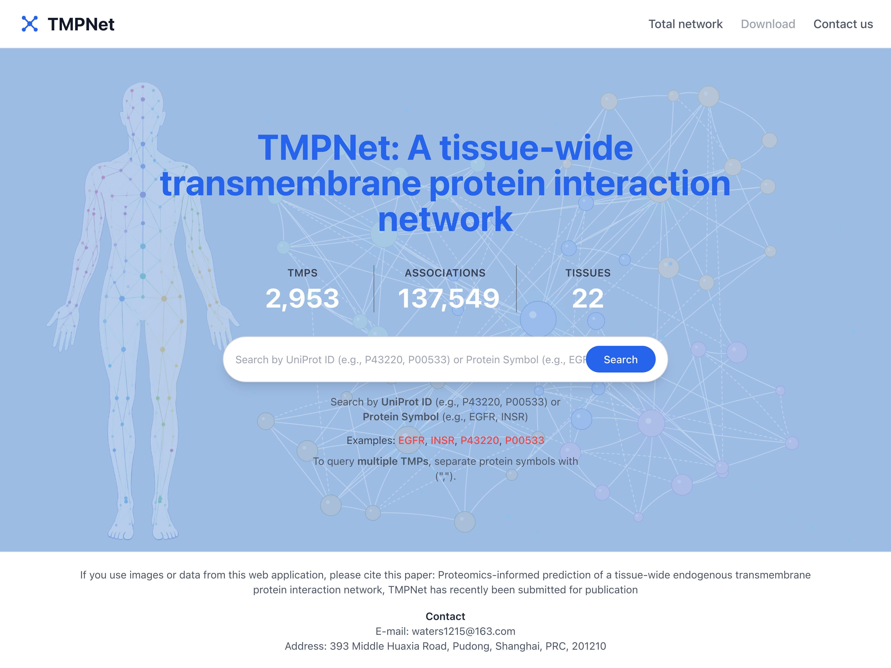

<div align="center">

# TMPNet

### TMPNet: A tissue-wide transmembrane protein interaction network.


<p>
  <a href="#why-tmpnet">Why</a> ◆
  <a href="#quick-start">Quick Start</a> ◆
  <a href="#preview">Preview</a> ◆
  <a href="#installation">Installation</a> ◆
  <a href="#architecture">Architecture</a> ◆
  <a href="#api-summary">API</a>
</p>

</div>

## Latest Updates 🔥

- **[2026/07]** Refreshed live network statistics and the generated network artifact behind the cover page.
- **[2026/07]** Fixed association-source labeling and coverage across the subgraph and evidence tables.
- **[2026/07]** Clarified single- vs. multi-protein subgraph views and stabilized the multi-query example in the product plan.

## Why TMPNet?

TMPNet gives researchers one web surface to go from "how big is this
dataset" to "what does this specific interaction look like structurally" —
without needing direct database or filesystem access.

- 🧬 **Whole-graph and focused views** — browse the full TMP interaction network, or jump straight to a UniProt accession / gene symbol neighborhood.
- 📊 **Live dataset stats** — the cover page reports current node/edge counts straight from `/api/network/stats`, so the numbers never go stale.
- 🧪 **Evidence-aware filtering** — filter by experimental vs. predicted edges and by interaction probability.
- 🧱 **Structure-linked** — subgraph edges link out to AlphaFold3-derived interaction models with per-residue confidence, viewable in-browser via NGL.
- 🐳 **Docker-only VM path** — ship a self-contained image bundle; the VM never needs Node.js, npm, psql, or the Supabase CLI.

## Quick Start

```bash
# 1. Install dependencies
npm install

# 2. Configure local file-mode data (see Installation for all options)
cat <<'EOF' > .env.local
MEMPPI_DATA_MODE=file
MEMPPI_DATA_ROOT=data/supabase-import/20260627_web_data
STRUCTURE_ASSET_ROOT=data/raw/20260627_web_data/best_structure
EOF

# 3. Run the app
npm run dev
```

Open `http://localhost:3000`.

> **Prerequisites**: Node.js 18.17+ or 20+, npm.
>
> **Need more options?** See [Installation](#installation) for Supabase-mode
> configuration and the [Docker-only VM Deployment](#docker-only-vm-deployment) path.

## Preview

<div align="center">
  
  <p><sub>Cover page (<code>/</code>) — live network stats, search, and a preview of the full network.</sub></p>
</div>

**Typical workflow:**

1. Land on `/` and see current node/edge counts plus a preview of the full network.
2. Search a UniProt accession or gene symbol (e.g. `EGFR`) to jump to `/subgraph?proteins=EGFR`.
3. Inspect the focused neighborhood, sort/filter/export the evidence table, and open any linked AlphaFold3 model at `/structures/[modelId]` for a confidence-colored 3D view.

## Current App Surface

- `/` is a cover page with summary stats, search, and dataset downloads.
- `/network` is the full network explorer with filters, graph metadata, and
  layout-cache aware rendering.
- `/subgraph?proteins=...` resolves UniProt IDs and gene symbols, then shows a
  focused neighborhood or intra-query subgraph.
- `/structures/[modelId]` renders AlphaFold3 interaction models with confidence
  summaries and asset downloads.

## Tech Stack

- Next.js 14 (Pages Router) + React 18 + TypeScript
- Local CSV data adapter for Docker-only VM deployment
- Cytoscape.js + `cytoscape-fcose`
- Tailwind CSS utilities in a custom global stylesheet
- Jest + React Testing Library

## Installation

This section covers full setup and alternative configuration. For the fastest
path, see [Quick Start](#quick-start) above.

### Environment Setup

```bash
# Repository is named MemPPI-Atlas; the product it ships is TMPNet.
git clone https://github.com/ENNCELADUS/MemPPI-Atlas.git
cd MemPPI-Atlas
npm install
```

### Configuration

**File mode (default for VM deployment)** — reads graph and structure data
from local CSVs, no database required:

```env
MEMPPI_DATA_MODE=file
MEMPPI_DATA_ROOT=data/supabase-import/20260627_web_data
STRUCTURE_ASSET_ROOT=data/raw/20260627_web_data/best_structure

# Optional; defaults to "structure-models"
SUPABASE_STRUCTURE_BUCKET=structure-models
NEXT_PUBLIC_SUPABASE_STRUCTURE_BUCKET=structure-models
```

**Supabase mode** — used when `MEMPPI_DATA_MODE` is not `file`. Requires
Supabase-compatible environment variables:

```env
NEXT_PUBLIC_SUPABASE_URL=...
NEXT_PUBLIC_SUPABASE_ANON_KEY=...
```

> **Security note**: never commit real credentials. `.env*` files are already
> in `.gitignore`.

### Run

```bash
npm run dev
```

Open `http://localhost:3000`.

## Docker-only VM Deployment

The supported VM path is local bundle creation followed by Docker-only VM
operation. Build the bundle on a local machine with Node.js/npm available:

```bash
npm run docker:vm:bundle
```

Copy `vm-docker-bundle/` to the VM and run:

```bash
./load-and-run.sh
```

The VM does not need Node.js, npm, npx, psql, or the Supabase CLI. The VM stack
runs only the Next.js app container, with the 20260627 graph data and relocated
structure assets built into the image. Storage bucket upload flows are not a
supported deployment path.

See [Docker-only VM Deployment](docs/local-supabase-docker.md).

## Architecture

TMPNet is a single Next.js app with three runtime concerns: Supabase-compatible
graph APIs, client-side Cytoscape rendering for large network views, and NGL-based
structure viewing.

```text
┌─────────────┐  /api/network/stats  ┌──────────────────┐
│  Cover (/)  │ ────────────────────▶│                  │
├─────────────┤  /api/network        │   Data adapter   │  file mode:
│  /network   │ ────────────────────▶│  (nodes, edges,  │  local CSVs under data/
├─────────────┤  /api/subgraph       │ structure_models)│  Supabase mode:
│  /subgraph  │ ────────────────────▶│                  │  Supabase-compatible tables
├─────────────┤  /api/structures/*   │                  │
│/structures/ │ ────────────────────▶│                  │
│  [modelId]  │                      └──────────────────┘
└─────────────┘
```

Layout positions are cached separately from graph data: `/api/network` and
`/api/subgraph` first try to read `graph_layout_cache`. When a position is
missing, the client computes a Cytoscape layout and posts it back to
`/api/layout-cache`; `CURRENT_LAYOUT_VERSION` is the invalidation switch for
all cached layouts.

See [docs/architecture.md](docs/architecture.md) for the full runtime and
data-pipeline breakdown.

## Repository Layout

```text
src/
  components/           Reusable UI building blocks
  lib/                  Shared types, transforms, graph helpers, Supabase utils
  pages/
    api/                Next.js API routes
    index.tsx           Cover page
    network.tsx         Full network explorer
    subgraph.tsx        Search result / focused graph view
    structures/         Structure detail pages
  styles/               Global CSS
data/
  raw/                  Raw source datasets
  supabase-import/      Generated CSVs ready for import
scripts/                Data preparation and validation utilities
sql/                    Base schema and SQL setup scripts
tests/                  Integration, page, component, and unit tests
docs/                   Current docs plus archived milestone notes
product_vision/         Product framing and current scope summary
```

## Scripts

```bash
npm run dev
npm run build
npm run start
npm run lint
npm run format
npm run format:check
npm test
npm run test:watch
npm run test:coverage
npm run prepare:data
npm run docker:vm:bundle
```

`prepare:data` normalizes the 20260627 graph dataset and writes:

- `data/supabase-import/20260627_web_data/nodes.csv`
- `data/supabase-import/20260627_web_data/edges.csv`

The current structure model dataset is 0407-derived and relocated under the
20260627 layout:

- `data/supabase-import/20260627_web_data/structure_models.csv`
- `data/raw/20260627_web_data/best_structure/`

Data files remain local and ignored by Git.

## API Summary

- `GET /api/network`
  Returns the filtered network, optional Cytoscape elements, and cached layout
  metadata.
- `GET /api/network/stats`
  Returns total nodes, total edges, family counts, enriched-edge counts, and
  predicted-edge counts.
- `GET /api/subgraph?proteins=EGFR,INSR`
  Resolves identifiers and returns a focused graph plus truncation metadata when
  limits apply.
- `POST /api/layout-cache`
  Persists or invalidates Cytoscape node positions by `graphKey`.
- `GET /api/structures/[modelId]`
  Returns structure, edge, protein, asset-link, and confidence-summary data.
- `GET /api/structures/[modelId]/asset?kind=cif|summary|confidences`
  Serves structure assets from the configured local structure asset root.
- `GET /api/test-db`
  Simple connectivity check kept in the repo for local verification.

See [docs/api.md](docs/api.md) for full request/response shapes.

## Data and Schema Notes

- `nodes` stores protein metadata keyed by UniProt accession.
- `edges` stores interaction evidence and filterable edge-level metadata.
- `graph_layout_cache` stores persisted Cytoscape positions keyed by a hashed
  graph signature.
- `structure_models` stores AlphaFold3-derived structure metadata and local
  asset paths.

The base schema is in `sql/`, and the structure-model expansion lives in
`supabase/migrations/20260409173000_add_structure_models_and_edge_evidence.sql`.

## Known Current Caveats

- The full network page defaults to showing both `experiment` and `prediction`
  edge types via client filters.
- The `/api/subgraph` route currently queries experimental rows using the
  literal value `experimental`, while `/api/network` uses `experiment`. The test
  suite reflects that current implementation detail.
- The sidebar toggle `onlyVisibleEdges` is present in the UI but is not yet
  wired into the `/api/network` request.

## Contributing

This repo follows the conventions in [AGENTS.md](AGENTS.md): Conventional
Commits (`feat:`, `fix:`, `refactor:`), the `@/` import alias, Prettier
formatting, and a 70% global Jest coverage floor. Before opening a PR:

```bash
npm run lint
npm test
npm run format:check
```

Include a short problem statement, test evidence, and screenshots or
recordings for any UI changes.

## License

No `LICENSE` file is currently included, and the package is marked `private`
in `package.json`. Treat the code as proprietary unless a license is added.

## Acknowledgments

- Structure models are derived from **AlphaFold3** interaction predictions.
- Graph and structure datasets originate from the raw exports under
  `data/raw/`.

## Documentation Map

- [Architecture](docs/architecture.md)
- [API Reference](docs/api.md)
- [Data Model](docs/data-model.md)
- [UI Specification](docs/ui-spec.md)
- [SQL Setup](sql/README.md)
- [Product Vision and Scope](product_vision/Product-Vision.md)
- [Milestone Notes](docs/milestone/v0/roadmap.md)

The files under `docs/milestone/` are retained as historical planning records.
They are no longer the canonical source for current setup or behavior.
</content>
