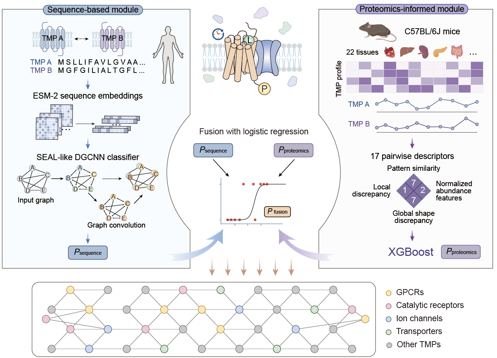

# TMPNet

**Proteomics-informed prediction of a tissue-wide endogenous transmembrane protein association network**

- **Code:** https://github.com/Shui-Group/TMPNet
- **Data and model files:** https://doi.org/10.5281/zenodo.21640085
- **Version corresponding to the manuscript:** [TO BE PROVIDED: release tag or commit hash]
- **Manuscript:** [TO BE PROVIDED: title, journal/preprint, year and DOI]

## Overview

TMPNet integrates protein language model-derived sequence embeddings with tissue-resolved proteomic signatures to infer transmembrane protein (TMP) associations that are shared across tissues or enriched in specific tissues. Using a TMP-focused tissue proteome map, the framework predicted 137,510 high-confidence TMP associations and constructed an endogenous human TMP association network termed **TMPNet**.

TMPNet consists of three components:

1. **Sequence-based model:** graph-based link prediction using ESM-2-derived protein representations.
2. **Proteomics-informed model:** XGBoost prediction using tissue-resolved proteomic features.
3. **Fusion framework:** logistic-regression integration of the sequence-based and proteomics-informed scores.



## Repository contents

```text
TMPNet/
├── README.md
├── environment.yml
├── DL_model_seal_link_pred.py
├── example/                                      # Example input files
├── scripts/
│   ├── 02_feature_generation/
│   │   └── proteomics_informed_model_feature_generation.py
│   ├── 03_model_training/
│   │   ├── 02_proteomics_informed_XGB.py
│   │   └── 03_Fusion_model.py
│   └── 04_TMPNet_construction/
│       ├── 02_ML_model_infer.py
│       └── 03_fusion_model_infer.py
├── results/                                      # Checkpoints and predictions
└── [TO BE PROVIDED: remaining folders in the released repository]
```

This repository provides [TO BE PROVIDED: model training, evaluation and inference code]. [TO BE PROVIDED: State whether downstream statistical analyses and manuscript figure-generation scripts are included.]

## Installation

TMPNet has been tested on [TO BE PROVIDED: operating system] with Python [TO BE PROVIDED], PyTorch [TO BE PROVIDED] and CUDA [TO BE PROVIDED]. The exact dependency versions are recorded in `environment.yml`.

```bash
git clone https://github.com/Shui-Group/TMPNet.git
cd TMPNet
conda env create -f environment.yml
conda activate TMPNet
```

Verify the installation:

```bash
python DL_model_seal_link_pred.py -h
```

Expected installation time: [TO BE PROVIDED].

## Data and pretrained models

Large files are distributed through Zenodo:

> https://doi.org/10.5281/zenodo.21640085

For **inference**, download the trained checkpoints for:

- the sequence-based model;
- the proteomics-informed model;
- the fusion model.

For **retraining**, also download:

- the protein sequence FASTA file;
- the precomputed ESM-2 3B embeddings;
- the generic PPI pretraining dataset;
- the TMP-specific fine-tuning dataset;
- [TO BE PROVIDED: any additional training files].

Place the downloaded files in:

```text
[TO BE PROVIDED: local directory and exact filenames]
```

Precomputed ESM-2 3B embeddings are recommended because regenerating them requires substantial computational time and GPU memory. The embedding-generation procedure is [TO BE PROVIDED: script or instructions].

## Usage

Example inputs are provided in `example/`. Replace all example paths with the paths to your own data.

### 1. Sequence-based model

#### Input

Example file:

```text
example/[TO BE PROVIDED: sequence-model input filename]
```

Required columns:

| Column | Description |
|---|---|
| `[TO BE PROVIDED]` | Protein A identifier |
| `[TO BE PROVIDED]` | Protein B identifier |
| `[TO BE PROVIDED]` | Interaction label, for training only |
| `[TO BE PROVIDED]` | Additional required field |

Protein identifiers use [TO BE PROVIDED: UniProt accessions or another identifier]. State whether `(A, B)` and `(B, A)` are treated as the same pair.

#### Inference

```bash
TMP_DATASET="finetune_custom_ppi"
NUM_WORKERS=32
NUM_SUBDATASETS=1
NUM_HOPS=1
EVAL_STEPS=1
RUNS=1
TRAIN_PERCENT=100

FINETUNED_MODEL="results/finetune_custom_ppi_20250718104155/DL_model_finetune.pth"
INFERENCE_BATCH_SIZE=32
INFERENCE_EPOCHS=751
INFERENCE_CONTINUE_FROM=50

python DL_model_seal_link_pred.py \
  --dataset "${TMP_DATASET}" \
  --only_pred_finetunenodes \
  --num_workers "${NUM_WORKERS}" \
  --num_subdatasets "${NUM_SUBDATASETS}" \
  --continue_from "${INFERENCE_CONTINUE_FROM}" \
  --resume_dir "${FINETUNED_MODEL}" \
  --batch_size "${INFERENCE_BATCH_SIZE}" \
  --num_hops "${NUM_HOPS}" \
  --use_feature \
  --dynamic_train \
  --dynamic_val \
  --dynamic_test \
  --eval_steps "${EVAL_STEPS}" \
  --runs "${RUNS}" \
  --epochs "${INFERENCE_EPOCHS}" \
  --train_percent "${TRAIN_PERCENT}"
```

Output: `[TO BE PROVIDED: output path, filename and score-column definition]`.

#### Pretraining on the generic PPI dataset

```bash
NUM_WORKERS=32
NUM_SUBDATASETS=1
NUM_HOPS=1
EVAL_STEPS=1
RUNS=1
TRAIN_PERCENT=100

GENERIC_DATASET="custom_ppi"
PRETRAIN_BATCH_SIZE=128
PRETRAIN_EPOCHS=150

python DL_model_seal_link_pred.py \
  --dataset "${GENERIC_DATASET}" \
  --num_workers "${NUM_WORKERS}" \
  --num_subdatasets "${NUM_SUBDATASETS}" \
  --batch_size "${PRETRAIN_BATCH_SIZE}" \
  --num_hops "${NUM_HOPS}" \
  --use_feature \
  --dynamic_train \
  --dynamic_val \
  --dynamic_test \
  --eval_steps "${EVAL_STEPS}" \
  --runs "${RUNS}" \
  --epochs "${PRETRAIN_EPOCHS}" \
  --train_percent "${TRAIN_PERCENT}"
```

Expected result directory:

```text
results/custom_ppi_[TIMESTAMP]/
```

#### Fine-tuning on the TMP PPI dataset

```bash
TMP_DATASET="finetune_custom_ppi"
PRETRAINED_RUN_DIR="results/custom_ppi_20250710144146"
FINETUNE_BATCH_SIZE=128
FINETUNE_EPOCHS=100
FINETUNE_CONTINUE_FROM=100

python DL_model_seal_link_pred.py \
  --dataset "${TMP_DATASET}" \
  --num_workers "${NUM_WORKERS}" \
  --num_subdatasets "${NUM_SUBDATASETS}" \
  --continue_from "${FINETUNE_CONTINUE_FROM}" \
  --resume_dir "${PRETRAINED_RUN_DIR}" \
  --batch_size "${FINETUNE_BATCH_SIZE}" \
  --num_hops "${NUM_HOPS}" \
  --use_feature \
  --dynamic_train \
  --dynamic_val \
  --dynamic_test \
  --eval_steps "${EVAL_STEPS}" \
  --runs "${RUNS}" \
  --epochs "${FINETUNE_EPOCHS}" \
  --train_percent "${TRAIN_PERCENT}"
```

Expected checkpoint:

```text
results/finetune_custom_ppi_[TIMESTAMP]/DL_model_finetune.pth
```

[TO BE PROVIDED: Describe the positive and negative labels, training/validation/test split, random seeds and checkpoint-selection rule.]

### 2. Proteomics-informed model

The proteomics-informed model calculates pairwise features from tissue-resolved protein-abundance profiles and applies a trained XGBoost classifier.

#### Input

Example file:

```text
example/[TO BE PROVIDED: proteomics-model input filename]
```

Required information:

| Field | Description |
|---|---|
| `[TO BE PROVIDED]` | Protein-pair identifier |
| `[TO BE PROVIDED]` | Tissue-resolved abundance values |
| `[TO BE PROVIDED]` | Tissue names and replicate information |
| `[TO BE PROVIDED]` | Label, for training only |

[TO BE PROVIDED: Document the tissue list, normalization, missing-value handling, replicate aggregation and definitions of the 17 pairwise descriptors.]

#### Feature generation

```bash
python scripts/02_feature_generation/proteomics_informed_model_feature_generation.py
```

Output: `[TO BE PROVIDED: generated feature-file path and columns]`.

#### Training

```bash
python scripts/03_model_training/02_proteomics_informed_XGB.py
```

Output: `[TO BE PROVIDED: trained XGBoost model filename]`.

#### Inference

```bash
python scripts/04_TMPNet_construction/02_ML_model_infer.py
```

Output: `[TO BE PROVIDED: proteomics-informed prediction filename and score-column definition]`.

### 3. Fusion framework

The fusion model combines the sequence-based and proteomics-informed prediction scores using logistic regression.

#### Input

Example file:

```text
example/[TO BE PROVIDED: fusion-model input filename]
```

Required columns:

| Column | Description |
|---|---|
| `[TO BE PROVIDED]` | Protein-pair identifier |
| `[TO BE PROVIDED]` | Sequence-based prediction score |
| `[TO BE PROVIDED]` | Proteomics-informed prediction score |
| `[TO BE PROVIDED]` | Label, for training only |

[TO BE PROVIDED: State the merge key, missing-score handling and any score normalization.]

#### Training

```bash
python scripts/03_model_training/03_Fusion_model.py
```

Output: `[TO BE PROVIDED: trained fusion-model filename]`.

#### Inference

```bash
python scripts/04_TMPNet_construction/03_fusion_model_infer.py
```

Final output: `[TO BE PROVIDED: final TMPNet prediction filename and directory]`.

The final output should define at least:

| Column | Description |
|---|---|
| `[TO BE PROVIDED]` | Protein A identifier |
| `[TO BE PROVIDED]` | Protein B identifier |
| `[TO BE PROVIDED]` | Sequence-based score |
| `[TO BE PROVIDED]` | Proteomics-informed score |
| `[TO BE PROVIDED]` | Final TMPNet association score |

A higher final score indicates [TO BE PROVIDED: exact interpretation]. The high-confidence threshold is [TO BE PROVIDED].

## Example run and runtime

The demo inference can be run on a standard desktop CPU.

```bash
[TO BE PROVIDED: one complete command that runs the demo]
```

| Task | Hardware | Approximate runtime |
|---|---|---|
| Demo inference | Standard desktop CPU | [TO BE PROVIDED] |
| Sequence-model pretraining | [TO BE PROVIDED] | [TO BE PROVIDED] |
| Sequence-model fine-tuning | [TO BE PROVIDED] | [TO BE PROVIDED] |
| Proteomics-model training | [TO BE PROVIDED] | [TO BE PROVIDED] |
| Fusion-model training | [TO BE PROVIDED] | [TO BE PROVIDED] |
| Full TMPNet inference | [TO BE PROVIDED] | [TO BE PROVIDED] |

The demo is intended to verify installation and execution; it is not intended to reproduce the complete TMPNet network.

## Reproducibility information

Before release, provide:

- dataset versions and accessions;
- exact input and checkpoint filenames in the Zenodo record;
- release tag or commit hash corresponding to the manuscript;
- random seeds;
- training/validation/test split strategy;
- model-selection metric;
- expected evaluation metrics and numerical tolerance;
- hardware used for the manuscript analysis;
- [TO BE PROVIDED: whether all downstream analysis and figure scripts are included].

## Data and code availability

Processed data and trained model files are available through Zenodo:

> https://doi.org/10.5281/zenodo.21640085

The TMPNet source code is available at:

> https://github.com/Shui-Group/TMPNet

[TO BE PROVIDED: Add a separate archived software DOI if the GitHub release is deposited independently from the data and checkpoint record.]

## Citation

```bibtex
@article{[TO_BE_PROVIDED_CITATION_KEY],
  title   = {[TO BE PROVIDED: manuscript title]},
  author  = {[TO BE PROVIDED: authors]},
  journal = {[TO BE PROVIDED: journal or preprint server]},
  year    = {[TO BE PROVIDED: year]},
  doi     = {[TO BE PROVIDED: manuscript DOI]}
}
```

## License

[TO BE PROVIDED: license name]. See `LICENSE` for details.

## Contact

- Code and data: [TO BE PROVIDED: name, affiliation and email]
- Corresponding author: [TO BE PROVIDED: name, affiliation and email]
